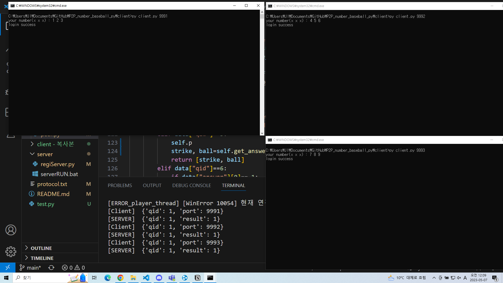

# 테스트 결과

## regiServer login
  
3개의 peer모두 서버에 로그인한 모습입니다.

## peer connection
  
1번 peer와 2번 peer 연결(논리적 연결)을 한 모습입니다

  
모든 peer가 연결된 상태입니다.

## game playing
  
1번 peer가 2번 peer의 숫자를 맞추는 모습입니다

## disconnect
  
1번 peer가 2번 peer와의 연결(게임)을 끊은 모습입니다. 

## peer logoff
  
  
peer가 사라졌을 때 regiServer가 이를 다른 peer에게 알려주고 해당 peer가 자신의 connection list에서 offline이 된 peer를 제외시킨 모습입니다.
